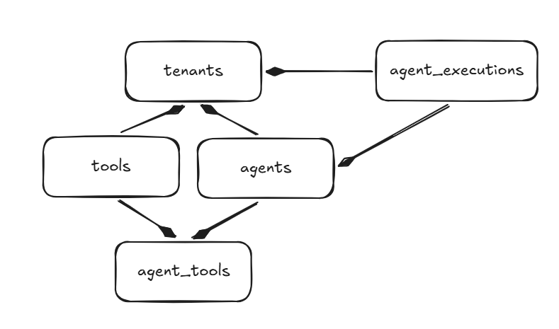
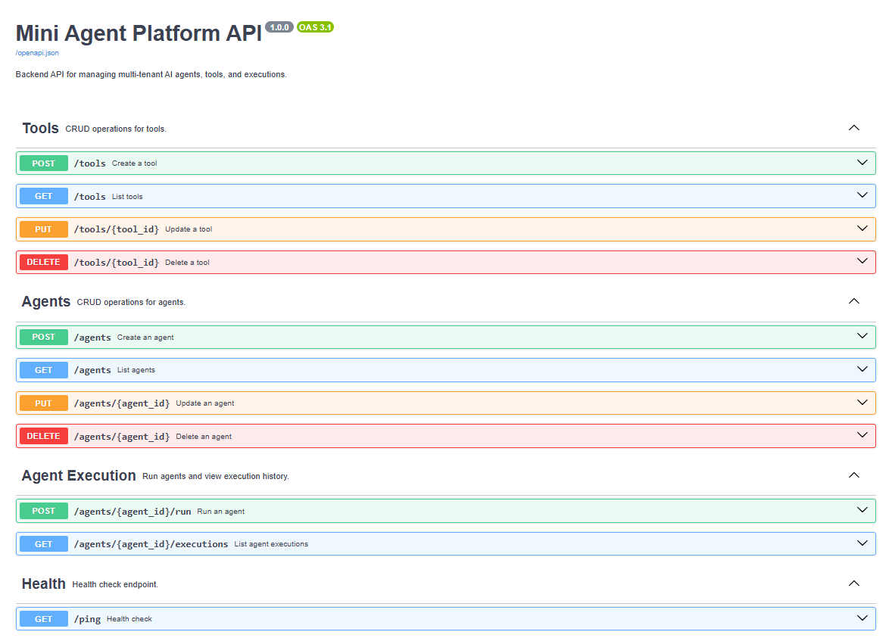
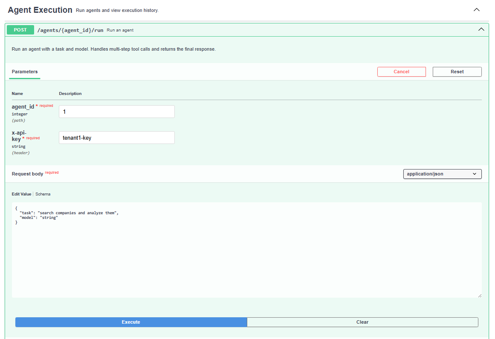
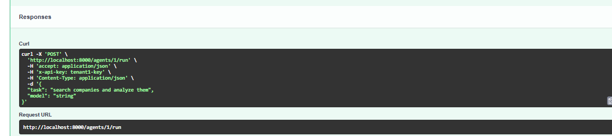

# Mini Agent Platform

## Overview
This is a backend-only Agent Platform built with FastAPI and SQLAlchemy. It supports multi-tenant agent and tool management, agent execution with a mock LLM, and execution history.


## Supported LLM Models
The following LLM models are supported and can be used for agent execution (see `app/core/config.py`):
- gpt-4o
- gemini

## Features
- Multi-tenant support (API key per tenant)
- CRUD for Agents and Tools
- Agent run endpoint with prompt-injection guardrail
- Mock LLM with multi-step tool call support
- Execution history with pagination
- Unit tests for main logic

SQL Structure:
https://excalidraw.com/#json=y90LEnJpNlp7RGsJpH4Xr,YES2KyeE1Rl9gyu_iZ3eaA


## Setup

1. **Install dependencies:**
   ```bash
   pip install -r requirements.txt
   ```

2. **Run PostgreSQL with Docker Compose:**
   ```
   docker compose up
   ```

3. **Prepare Alembic for migrations:**
   - Create Alembic configuration file `alembic.ini`
   - Initialize folder hierarchy:
     ```bash
     alembic init app/migrations
     ```
   - Update `env.py` as described in the code comments to set `target_metadata`.

4. **Generate a new Alembic migration file:**
   ```bash
   alembic revision --autogenerate -m "Initial tables"
   ```

5. **Apply the migration to the database:**
   ```bash
   alembic upgrade head
   ```

6. **Start the API server:**
   ```bash
   uvicorn app.main:app --reload
   ```

## API Authentication

- Each request must include an `x-api-key` header with a valid tenant API key.
- Example: `x-api-key: tenant1-key`

## Running Tests

```bash
pytest
```

# Tenant API Keys

The following API keys are supported for authentication. These are defined in `app/core/config.py` and correspond to the hardcoded tenants:

```
tenant1-key
tenant2-key
tenant3-key
```

---

# API Documentation

Interactive OpenAPI docs are available at:  
[http://localhost:8000/docs](http://localhost:8000/docs)


---

# Quick Start

1. **Create Tools and Agents**  
    Assign tool IDs to an agent as needed.

2. **Run an Agent**  
    
    

---

# Example Agent Run Output

Below is a sample response for a typical agent execution:

```json
{
   "final_response": "Final answer based on tool outputs: [\"search processed {'query': 'search companies and analyze them'}\", 'summarizer says: DONE']",
   "tool_calls": [
      {
         "role": "tool",
         "name": "search",
         "content": "ERROR: simulated failure",
         "status": "error",
         "attempt": 1,
         "input": {
            "query": "search companies and analyze them"
         }
      },
      {
         "role": "tool",
         "name": "search",
         "content": "search processed {'query': 'search companies and analyze them'}",
         "status": "success",
         "attempt": 2,
         "input": {
            "query": "search companies and analyze them"
         }
      },
      {
         "role": "tool",
         "name": "summarizer",
         "content": "summarizer says: DONE",
         "status": "success",
         "attempt": 1,
         "input": {
            "text": "search processed {'query': 'search companies and analyze them'}"
         }
      }
   ],
   "prompt": "### SYSTEM\n\nYou are an AI agent.\n\nYou can use tools to complete the task.\n\nRules:\n- Use tools only when needed\n- Do not repeat the same tool call with the same input after a successful execution\n- If a tool fails, you may retry until retry limit is reached\n- Follow tool dependencies\n- Return FINAL when task is complete\n\n### TOOLS\n\nAvailable tools:\n- search (intent=search, requires=[])\n- summarizer (intent=summarize, requires=['search'])\n\n### USER\n\nTask: search companies and analyze them"
}
```
